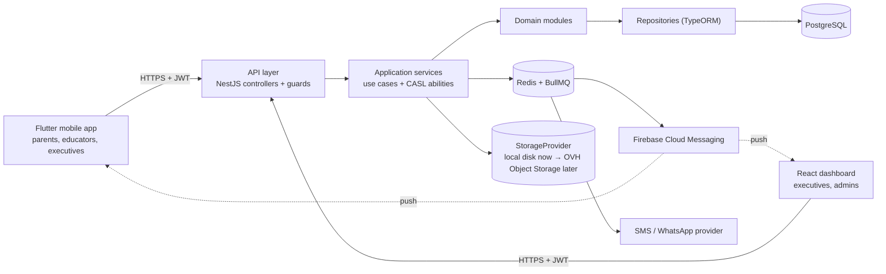
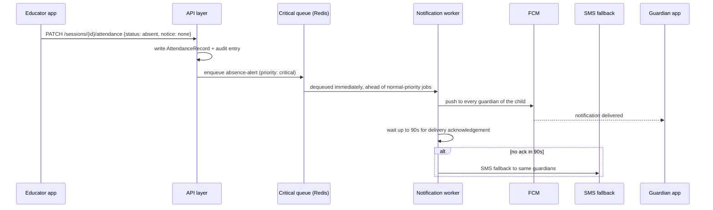

# System Architecture

## Components

One deployable (the NestJS API), one database. No microservices — module boundaries are enforced by code review and lint rules, not network hops.

## Backend modules

One module per bounded context, importable by others only through an exported service — never a shared repository:

`identity` · `org-structure` · `children` · `sessions` · `attendance` · `homework` · `materials` · `messaging` · `announcements` · `memories` · `notifications` · `dashboard` · `audit`.

See `07-backend-spec.md` for what lives in each.

## The instant-absence-alert mechanism

The one safety-critical path in the system (`ATT-07`). "Instant" is implemented as a dedicated critical-priority queue plus a delivery-acknowledgement timeout that falls back to SMS — not just a push call inside the request handler.

Target SLA: p95 push dispatch under 30s from the attendance write. Load-test this specifically before pilot (see `11-testing-strategy.md`) — it's the one number in the whole product that's actually a safety commitment.

## Request flow, permission enforcement

Every mutating request resolves `can(user, action, resource)` against the resource named in the URL (never trusted from the client) before the service layer runs — see `05-authorization.md`. Dashboard queries (`dashboard` module) reuse the exact same permission-scoped services as the mobile API; there is no separate reporting path that could bypass a scope check.

## Offline

Only two things work offline, deliberately narrow (see `06-mobile-app-spec.md` and the scope's `ATT-06`):
- Today's sessions + attendance marking (Drift-backed local queue, synced on reconnect)
- Presence-confirmation answers

Everything else (messaging, Memories Wall, announcements) is read-cached, write-online-only.
