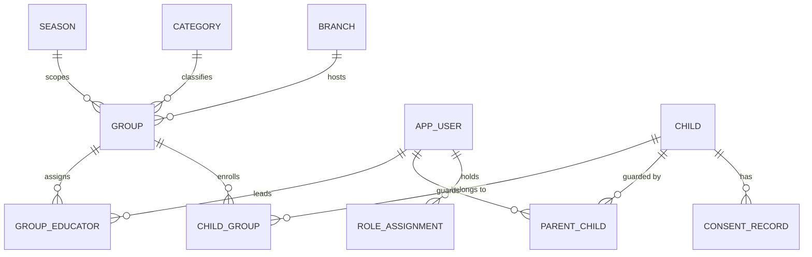
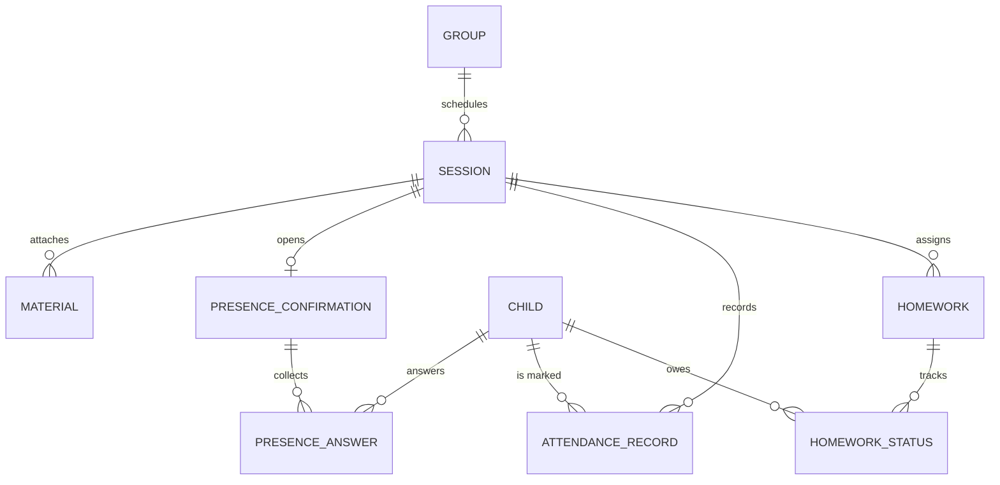

# Domain Model

Companion to [`schema.sql`](./schema.sql) — read that file for exact columns/types; this file is the relationships and the fields that need product explanation.

## Org & people graph

`child_group` and `parent_child` are the two join tables every permission scope in `05-authorization.md` traverses. Both are append-only (`valid_from`/`valid_to`, `linked_at`/`unlinked_at`) so moving a child between groups or unlinking a guardian keeps full history — never an update-in-place.

## Session & attendance graph

`attendance_record.corrected_from` self-references the prior row on a correction — the audit trail for attendance is queryable directly, without joining `audit_log_entry`.

## Fields that need product explanation

| Field | Why it's shaped this way |
|---|---|
| `child.health_json` (jsonb) | One versioned JSON column, not one column per health field. Health data changes shape more often than the rest of the schema, and every *access* is logged via `audit_log_entry` regardless of column layout — so a rigid column-per-field design buys nothing. **Exact keys are open decision #2** (`01-product-brief.md`) pending the CNDP filing; until then, treat this as `{ allergies?: string[], conditions?: string[], medications?: string[], dietary_notes?: string }` as a working draft. |
| `category.min_age` / `max_age` / `gender` | Nullable until open decision #1 lands. The 8 category names from the product scope (§5.2) should be seeded now (`الأشبال`, `النخبة`, `الفتية`, `اليافعون`, `الصغار`, `الفراشات`, `الزهرات`, `اليافعات`); ranges/gender fill in when confirmed. `gender` is an enum (`boys`/`girls`/`mixed`), not free text — a group's children must match its category's gender, enforced in the `children` service, not just the UI. |
| `session.is_customized` | Set `true` the first time an educator edits an auto-generated session. The weekly-schedule regenerator (`ORG`/`SES-02`) must skip any session where this is `true` — protects a volunteer educator's prep work from a schedule change elsewhere. |
| `attendance_record.recorded_at` vs `recorded_at_client` | Two different times, both needed: `recorded_at` is server-assigned (source of truth for "who wrote last"); `recorded_at_client` is what the offline device believed when it queued the write. The API rejects a write with `attendance.conflict` when its `recorded_at_client` predates the current row's `recorded_at` — see `04-api/conventions.md`. |
| `album.moderation_mode` | Defaults to `publish_then_moderate` (the scope's Q4 suggested default). **Open decision #3** — flip the default or make it per-group once confirmed. |
| `consent_record` | Append-only. "Current" consent for `(child_id, type)` is the row with the latest `effective_at`. Two guardians can each write independent rows; the `children` service resolves conflicts most-restrictive-wins (if any guardian's current `image_rights` row is `not_allowed`, that applies) and flags the disagreement to executives — this resolution logic lives in application code, not the schema. |

## V1 additions (not in `schema.sql` yet)

Add when V1 starts: `event` (shaped like `session` + `capacity` + a waiting-list table), `event_registration`, `parental_authorization` (reuses the `consent_record` versioning pattern), `enrollment_fee` (`guardian_user_id`, `season_id`, `amount_due`, `amount_paid`, `method`), `pickup_person` (`child_id`, `name`, `relationship`, `phone`, `photo_url`).
